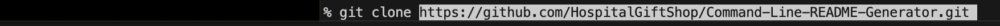

# Command Line README Generator

  

## Description

This application was built to help developers quickly and easily generate a high quality README file so they can spend more time focusing on their project.

When creating a README from scratch, it can be time consuming and cumbersome to format the file, add the specific details, and review the file for any errors.  The Command Line README Generator help users save time by providing them with a ready made format and questions to get them started.

In creating this application, I learned how to install different packages using npm.  This application uses the Inquirer Package and was simply installed using the command line by entering 'npm i inquirer'.  This project helped me gain deeper knowledge of JavaScript such as creating files and importing packages for the application to use. Additionally, it helped me became more familiar / comfortable using the command line.

## Table of Contents

- [Installation](#installation)
- [Usage](#usage)
- [License](#license)
- [Contributions](#contributions)
- [Tests](#tests)
- [Questions](#questions)

## Installation

1. Open the command line and navigate to the location on your machine where you would like the application installed.
2. Clone the repository in your command line by entering: git clone <https://github.com/HospitalGiftShop/Command-Line-README-Generator.git>

3. Install Node.js (if not already installed).  Node.js will allow you to run the application directly in the command line.  
      [Node.js Website](https://nodejs.org/en)  
      [Node.js Package Manager](https://nodejs.org/en/download/package-manager)

Optional:

You may also want to install and use a code editor such as [Visual Studio Code](https://code.visualstudio.com/) to help make additional edits or preview your README file once created.

## Usage

In the command line, navigate (cd 'folder name') to the folder where the index.js file is located.  While still in the command line type: node index.js

You will be prompted with a series of questions.  After you have completed your response to a question, simply press enter on your keyboard to move to the next question.  Once you have answered the final question you will be prompted with the message "Your README file has been created."  

## License

Licensed under the [MIT](https://opensource.org/licenses/MIT) license.

## Contributions

For this project I discussed different ideas and formatting with Brandon Bybee.

## Tests

To test the application, open the command line and navigate to the directory where index.js is located.  Type 'node index.js' and hit enter on your keyboard.  Answer the questions as prompted.

## Questions

If you have any questions, please email me at <tmeans01@gmail.com> or for more information visit [GitHub](https://github.com/HospitalGiftShop).
